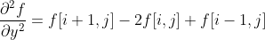

# 경계선 검출

1. Laplacian filter를 이용하여 가장자리(edge)를 검출합니다.

2. Laplacian filter는 noise에 민감하기 때문에, 이미지에 blur처리가 필요하므로 Gaussian blur를 사용합니다.

3. Laplacian filter가 적용된 이미지에 대해, 과제에서 제공받은 함수 FindZeroCrossings()를 통해 edge를 찾고, 허프변환을 이용하여 경계선을 그립니다.

	
## Image processing

이미지는 각 픽셀 값을 원소로 가지는 하나의 행렬로 생각할 수 있습니다.

이 때, 한 픽셀의 값에 대해 여러 연산을 적용하는 point operation과 원본 이미지의 일정 block 영역과 filtering block을
convolution하는 area operation을 사용하여 새로운 이미지를 생성 할 수 있습니다.

q(x&space;-&space;j,&space;y&space;-i&space;))


## 소스코드

```cpp
for (i = 1; i < 6; i++) {
	sigma = i;
	GaussianBlur(gray_img, gaussian_img, Size(5, 5), sigma, 0, BORDER_DEFAULT);
	Laplacian(gaussian_img, laplacian_img, CV_32F, 3, 1, 0, BORDER_DEFAULT);
	FindZeroCrossings(laplacian_img, zero_crossing_lapl);
	convertScaleAbs(zero_crossing_lapl, Abs_zero_crossing);

	version[0] = '0' + i;
	String ver(version);

	tmp1 = str1 + ver + format_name;
	tmp2 = str2 + ver + format_name;
	tmp3 = str3 + ver + format_name;

	imwrite(tmp1, gaussian_img);
	imwrite(tmp2, laplacian_img);
	imwrite(tmp3, Abs_zero_crossing);

}
```
Laplacian filter는 노이즈에 민감하므로, 먼저 이미지에 blur를 적용해야 합니다. blur는 Gaussian blur를 사용하였습니다.

Gaussian blur는 Gaussian distribution을 따르는 kernel을 만들고 원본이미지와 convolution을 하게 됩니다.
우선 5by5 커널 사이즈의 크기로 하며, Gaussian distribution에서 표준편차 sigma 값을 1부터 5까지 변화시키면서 적용합니다.

위에서 구현한 기존 filtering에서는 모든 kernel이 동일한 값을 가지지만, Gaussian distribution에서는 중심 픽셀의 가중치가 높고 
주위의 인접 픽셀들의 가중치는 낮게 잡습니다.


[이미지 출처](https://www.researchgate.net/figure/2D-Gaussian-distribution-with-mean-0-0-and-s-1-Source-http-wwwceehwacuk_fig1_26487220)

그 다음으로, Gaussian blur가 적용된 이미지들에 대해 Laplacian filtering를 적용하게 됩니다.
사람의 얼굴이나 도로의 선과 같이 경계선을 찾기위해서는 이미지의 픽셀값이 갑자기 변하는 부분을 찾아야 합니다.
Laplacian filtering에서는 이러한 픽셀들의 경계를 2차 미분항들로 구합니다.


index i는 y방향, 이미지에서는 열(column)에 대응되고

index j는 x방향, 이미지에서는 행(row)에 대응됩니다.


픽셀의 중심을 i, j로 하기 위해 i = i - 1, j = j - 1로 치환하면




이러한 결과를 2 dimensional에 대해 kernel로 나타내면 아래와 같습니다.


zero crossing을 찾는 FindZeroCrossings()정의 함수는 과제에서 제공받은 함수입니다.

```cpp
*output_pixel = (difference > laplacian_threshold) ? 255 : 0;
```
내부적으로는 임계값(threshold)을 비교하여 edge를 정의합니다.

```cpp
HoughLinesP(abs_road, lines, 1, CV_PI / 180, threshold);
```
FindZeroCrossings()가 적용된 이미지에서 경계선에 선을 그리기위해 허프변환을 이용합니다.

## 결과 이미지

Lenna 이미지에 적용

1. Gaussian blur 적용


2. Laplacian filter 적용


3. Zero crossing 적용


***

도로 이미지에 적용

1. Laplacian filter 적용


2. Zero crossing과 호프 변환 적용


