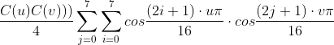
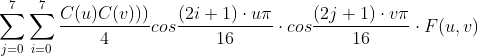

# DCT Lossy Compression

원본 이미지에 대해서 특정 block에 대해 frequency domain으로 옮기게 되면, 각 픽셀의 얼마나 값이 변하는가에 대한 정보를 알 수 있습니다.

이 때, low frequency쪽으로 많은 수의 signal 성분이 분포하게 됩니다. 
이는 특정 블록에 대해 인접한 픽셀들간에는 픽셀값이 비슷한 성분이 많음을 의미합니다. 따라서 사람의 시각에서 미세한 이미지의 변화인 높은 주파수 보다, 다수를 차지하고 있는
낮은 주파수 성분과 DC성분에 좀 더 민감하므로 이를 이용하여 높은 주파수의 성분은 제거 하고 낮은 주파수의 성분만을 이용하는 것이 DCT lossy compression 입니다.

lossy compression이므로, 원본 이미지와 완전히 동일한 data를 가지고 있지는 않지만 원본 이미지에 거의 상응하는 수준의 data를 가지고 있습니다.

DCT는 원래의 signal값을 DC성분과 AC성분으로 분리하며, IDCT는 그렇게 분리된 성분들을 다시 재합성합니다.

## 소스 코드

```cpp
	for (u = 0; u < 8; u++) {
		for (v = 0; v < 8; v++) {
			eachblock = (float**)malloc(sizeof(float*) * 8);
			for (i = 0; i < 8; i++) {
				eachblock[i] = (float*)malloc(sizeof(float) * 8);
				for (j = 0; j < 8; j++) {
					if (u == 0)Cu = 1 / sqrt(2.0);
					else Cu = 1;
					if (v == 0)Cv = 1 / sqrt(2.0);
					else Cv = 1;

					eachblock[i][j] = ((Cu * Cv) / 4.0) * cos(((2 * i + 1) * u * pi) / 16.0) * cos(((2 * j + 1) * v * pi) / 16.0);


				}
			}
			block[u][v] = eachblock;
		}
	}
```
전체 DCT image basis block을 8 by 8로 잡고, 각 block은 다시 하나의 DCT basis matrix를 가집니다.
가령 예를 들어서 block[0][0]은 DC성분만을 가지는 DCT basis function이 됩니다.

각각의 DCT basis function의 값을 계산하는 코드는 아래와 같은 수식에 대응됩니다.



<br>
<br>
<br>

```cpp
	for (l = 0; l < gray_img.rows; l += 8) {
		for (k = 0; k < gray_img.cols; k += 8) {
			//여기에 dct , idct 수행
			for (i = 0; i < 8; i++) {
				for (j = 0; j < 8; j++) {
					tmp_mat.at<uchar>(i, j) = gray_img.at<uchar>(l + i, k + j);
				}
			}//원본이미지의 일부분인 8by8만 가져오기

			for (i = 0; i < 8; i++) {
				for (j = 0; j < 8; j++)tmp_result.at<double>(i, j) = 0;//주파수 도메인 결과값을 담을 임시 배열을 초기화
			}
			/*******************************여기까지 original image의 8by8 매트릭스 추출********************************/


			for (u = 0; u < 8; u++) {
				for (v = 0; v < 8; v++) {
					readblock = block[u][v];
					for (i = 0; i < 8; i++) {
						for (j = 0; j < 8; j++) {
							tmp_result.at<double>(u, v) += readblock[i][j] * tmp_mat.at<uchar>(i, j);
							//원본이미지의 8by8만 가져온것과 basis image를 내적
						}
					}

				}
			}
			//Mat::tmp_result객체는 DCT가 적용된 결과물


			for (i = 0; i < 8; i++) {
				for (j = 0; j < 8; j++) {
					result8by8.at<uchar>(l + i, k + j) = IDCT(tmp_result, i, j, 8, block[i][j]);
					result4by4.at<uchar>(l + i, k + j) = IDCT(tmp_result, i, j, 4, block[i][j]);
					result2by2.at<uchar>(l + i, k + j) = IDCT(tmp_result, i, j, 2, block[i][j]);
				}
			}


		}

	}
```
원본 이미지에 대해 계산한 DCT basis값을 적용하는 부분입니다.

우선 원본 이미지의 8 by 8 block부분만 가져옵니다. 이 행렬값들을 위에서 계산한 DCT basis function이 가지는 값 matrix와
내적을 하게 됩니다. 즉 아래와 같은 수식을 수행하게 됩니다.


이렇게 DCT가 적용이 되면, Lenna 이미지에서 어느 한 블록에 인접한 픽셀들끼리는 low frequency에 몰려있기 때문에 적은 수의 high frequency
성분들을 제거하여 이미지의 용량을 줄일 수 있습니다.

마지막으로 8by8, 4by4, 2by2의 block 크기로 IDCT를 적용해 원본 이미지를 구합니다. 


```cpp
void showDCT(float** basis, int num) {
	int v, u;

	printf("====================DCT basis matrix(0, %d) 값 출력====================\n", num);
	for (v = 0; v < 8; v++) {
		for (u = 0; u < 8; u++) {
			printf("%8.3f ", basis[v][u]);
		}
		printf("\n");
	}
	printf("\n\n");
}
```
DCT basis function 값에 대해 block[0][0]에서 부터 block[0][7]까지의 성분값을 표시하는 함수 입니다.
위 수식에서 u값이 0으로 고정된 상수이므로 v로만 이루어진 1dimensional basis function으로 생각할 수 있습니다.

이러한 DCT basis function에 대한 값들을 아래와 같은 그래프로 확인할 수 있습니다.
그래프들은 matlab으로 구현하였습니다.

```matlab

```


```cpp
char IDCT(Mat DCTed, int i, int j, int mode, float** basis) {
	double result;
	double Cv, Cu;
	int u, v, m, n;
	result = 0;
	for (u = 0; u < mode; u++) {
		for (v = 0; v < mode; v++) {
			if (u == 0)Cu = 1 / sqrt(2.0);
			else Cu = 1;
			if (v == 0)Cv = 1 / sqrt(2.0);
			else Cv = 1;
			result += ((Cu * Cv) / 4.0) * cos(((2 * i + 1) * u * pi) / 16.0) * cos(((2 * j + 1) * v * pi) / 16.0) * DCTed.at<double>(u, v);
		}
	}


	return (char)result;
}
```
Inverse DCT를 계산하는 함수입니다.

IDCT의 경우, 아래와 같은 수식에 의해 구할 수 있습니다.



## 결과 이미지