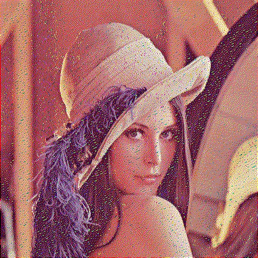
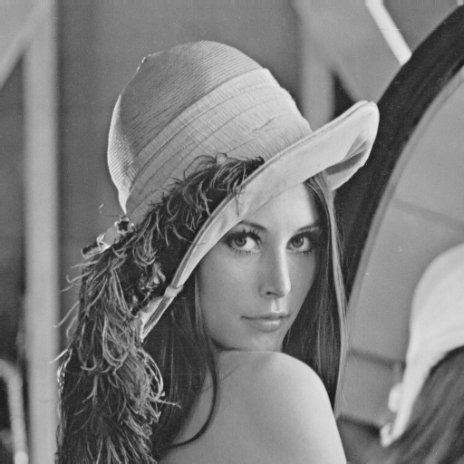

# Error diffusion dithering

Lenna image에 대해 openCV 라이브러리를 이용하여, Lenna image를 읽어 들이고, dithering을 적용하기 전과 적용한 후에 대한 결과를 표시하는
프로그램입니다.

## Dithering


특정 디바이스에서는 성능이 부족해서, 원이미지나 원영상을 똑같이 출력하기가 힘든 경우가 있습니다. 가령 예를 들어, 흑백 프린터기난 휴대용 게임기와 같은 디바이스는 성능이 제약되어
original media의 모든 색상이 사용이 불가능합니다.

이런 경우, 다른 색상이나 픽셀 값을 섞어서 시각적으로 비슷한 색상을 내도록하는 것이 dithering입니다.

알고리즘 전개 방식은 하나의 픽셀 값은 2by2, 또는 4by4 더 큰 픽셀 패턴으로 바꾸는 것입니다.

Example) 2bits 색상 값(0, 1, 2, 3)을 가질 수 있는 경우 아래와 같은 dithering matrix를 이용하여 표현 할 수 있습니다.


## Error diffusion dithering

dithering시 발생하는 픽셀 값에 대한 quantization error를 줄이는 방법입니다.

즉, 어느 한 픽셀에서 발생한 error(noise)를 주변 픽셀로 확산시킵니다.


## 소스코드

```cpp
	img = imread("Lenna.png", IMREAD_COLOR);
	after_col_img = imread("Lenna.png", IMREAD_COLOR);

	cvtColor(img, gray_img, COLOR_BGR2GRAY);
	cvtColor(img, after_img, COLOR_BGR2GRAY);
```

Lenna 이미지를 읽어 들여, Mat 객체 img에 저장합니다.

그런다음, 두 개의 gray 이미지를 생성합니다.
이 중 하나는 오차 확산 dithering을 적용할 이미지입니다.(after_img)


```cpp
	for (i = 0; i < after_img.rows - 1; i++) {
		for (j = 1; j < after_img.cols - 1; j++) {
			if (after_img.at<uchar>(i, j) > 127)error = after_img.at<uchar>(i, j) - 255;
			else error = after_img.at<uchar>(i, j);
			after_img.at<uchar>(i, j + 1) += (uchar)((error * 7) / 16);
			after_img.at<uchar>(i + 1, j - 1) += (uchar)((error * 3) / 16);
			after_img.at<uchar>(i + 1, j) += (uchar)((error * 5) / 16);
			after_img.at<uchar>(i + 1, j + 1) += (uchar)((error * 1) / 16);
		}
	}
	for (i = 0; i < after_img.rows; i++) {
		for (j = 0; j < after_img.cols; j++) {
			if (after_img.at<uchar>(i, j) <= 127)after_img.at<uchar>(i, j) = 0;
			else after_img.at<uchar>(i, j) = 255;
		}
	}

	imwrite("result.jpg", after_img);
```
하나의 이미지는 각 원소가 픽셀이고, m개의 행과 n개의 열로 이루어진 행렬로 생각할 수 있습니다.

이러한 이미지를 0행부터 이미지의 마지막 행까지, 그리고 1열부터 이미지의 마지막열까지 가중치창을 곱해서 더하는 과정인 확산을 반복하게 됩니다.
이때의 가중치 값은 아래와 같습니다.

<table>
<tr><td>0</td><td>p</td><td>7/16</td></tr>
<tr><td>3/16</td>5/16<td></td><td>1/16</td></tr>
</table>

p = after_img.at<uchar>(i, j)
특히 p를 제외하고 모든 가중치의 합은 1이 됩니다. 이는 가중치의 모든합이 1을 넘지 않아야 원래 이미지의 밝기를 유지할 수 있습니다.

가중치 확산 과정이 끝나게 되면, 각 픽셀의 값을 0또는 1로 변환 하는 과정을 거치게 됩니다.
original gray image의 경우 0~255사이의 값을 가질 수 있으므로, threshold 기준인 127이상이면 1로, 그렇지 않은 경우 0으로 픽셀 밝기 값을 변경합니다.

```cpp
for (t = 0; t < 3; t++) {
		for (i = 0; i < after_col_img.rows - 1; i++) {
			for (j = 1; j < after_col_img.cols - 1; j++) {

				if (after_col_img.at<Vec3b>(i, j)[t] > 127)error = after_col_img.at<Vec3b>(i, j)[t] - 255;
				else error = after_col_img.at<Vec3b>(i, j)[t];
				after_col_img.at<Vec3b>(i, j + 1)[t] += (error * 7) / 16;
				after_col_img.at<Vec3b>(i + 1, j - 1)[t] += (error * 3) / 16;
				after_col_img.at<Vec3b>(i + 1, j)[t] += (error * 5) / 16;
				after_col_img.at<Vec3b>(i + 1, j + 1)[t] += (error * 1) / 16;
			}

		}
	}


	for (t = 0; t < 3; t++) {
		for (i = 0; i < after_col_img.rows; i++)
			for (j = 0; j < after_col_img.cols; j++) {
				if (after_col_img.at<Vec3b>(i, j)[t] <= 127) after_col_img.at<Vec3b>(i, j)[t] = 0;
				else after_col_img.at<Vec3b>(i, j)[t] = 255;
			}
	}
```

다음으로 color image에 대한 error diffusion dithering을 적용하는 부분입니다.
gray image와 마찬가지로 모든 행과 열에 대해 오차 확산을 적용시키는 과정이 있는데, 대신 gray와는 달리 color이미지 이므로 R, G, B 3가지 색상에 대해
오차 확산을 모두 계산해 주어야 합니다.

오차확산이 모두 계산되면, R, G, B 각각에 대해 threshold값을 기준으로 밝기 값을 변경합니다.
즉 Red에서 127이상이면 밝기를 255로, 그렇지 않은 경우 밝기값을 0으로 합니다.
이 과정을 Green과 Blue에 대해서도 적용 해 줍니다.

## 결과

* 원본 color 이미지


* error diffusion dithering이 적용된 color 이미지



* gray 이미지



* error diffusion dithering이 적용된 gray 이미지


